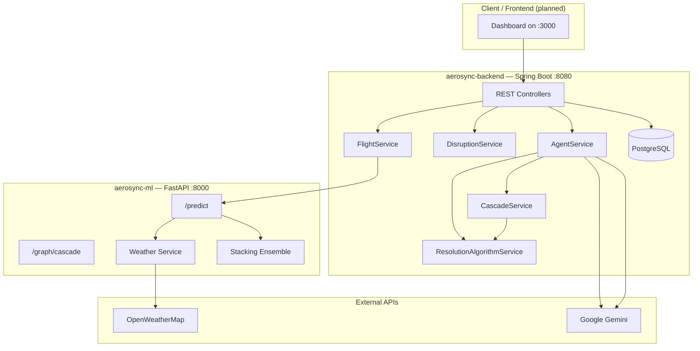

# AeroSync

**Intelligent flight delay prediction and autonomous disruption resolution for airport operations.**

AeroSync is a full-stack aviation operations platform that combines machine learning, rule-based constraint solving, and generative AI to predict flight delays, simulate cascade effects across a flight network, and resolve operational disruptions in seconds — with optional human-in-the-loop approval.

Built as a portfolio project demonstrating end-to-end system design across backend engineering, data science, and applied AI.

---

## Table of Contents

- [Overview](#overview)
- [Problem Statement](#problem-statement)
- [Key Features](#key-features)
- [System Architecture](#system-architecture)
- [Tech Stack](#tech-stack)
- [Project Structure](#project-structure)
- [Machine Learning Pipeline](#machine-learning-pipeline)
- [Disruption Resolution Engine](#disruption-resolution-engine)
- [API Reference](#api-reference)
- [Getting Started](#getting-started)
- [Configuration](#configuration)
- [Skills Demonstrated](#skills-demonstrated)
- [Roadmap](#roadmap)
- [License](#license)

---

## Overview

When a single flight is delayed, downstream effects ripple through gates, crew rotations, aircraft positioning, and passenger connections. Airlines often coordinate these manually — a slow process that scales poorly during peak disruption windows.

AeroSync addresses this with three integrated layers:

1. **ML prediction service** — A calibrated stacking ensemble scores delay risk per flight using operational, seasonal, and live weather features.
2. **Spring Boot operations API** — Persists flights, gates, crew, and disruptions in PostgreSQL; orchestrates predictions, scheduling, and resolution workflows.
3. **Hybrid resolution agent** — Deterministic algorithms enforce DGCA-style operational rules and make reassignment decisions; Google Gemini generates concise human-readable explanations; cascade logic propagates impact to connected flights.

---

## Problem Statement

A delay on one flight can trigger a chain of failures:

- Crew may approach or exceed **12-hour duty limits** (DGCA regulations)
- **Gates** become blocked for the next rotation
- **Passengers** miss minimum connection buffers
- **Aircraft** may be unavailable for the next leg

Manual coordination between ops teams typically takes **20–40 minutes** and still yields suboptimal outcomes. AeroSync demonstrates how software can **detect risk early**, **model cascade impact**, and **propose or apply resolutions** with full audit trails stored in the database.

---

## Key Features

| Area | Capability |
|------|------------|
| **Delay prediction** | Stacking ensemble (Random Forest, XGBoost, Gradient Boosting, MLP) with probability calibration and explainable top delay factors |
| **Live weather** | OpenWeatherMap integration for Indian hub airports (BOM, DEL, BLR, HYD) |
| **Cascade simulation** | NetworkX directed graph for aircraft-rotation propagation and critical-path analysis |
| **Rule engine** | DGCA duty-hour checks, weather/aircraft compatibility, gate turnaround constraints |
| **Hybrid AI resolution** | Algorithm decides; Gemini explains; failures degrade gracefully to rule-based output |
| **Human-in-the-loop** | Propose → approve/reject workflow with feedback-driven re-reasoning |
| **Operations data** | JPA entities for flights, gates, crew, disruptions; JSONB resolution storage |
| **Schedule generation** | Daily flight schedule seeded with live weather scores on startup |
| **Auth** | JWT-based login for API consumers |

---

## System Architecture



**Resolution flow (hybrid mode)**

1. Trigger or simulate a disruption on a flight.
2. `ResolutionAlgorithmService` runs the rule engine and resolves gate, crew, and passenger constraints.
3. `AgentService` requests a short ops brief from **Gemini** (explanation only — not decision-making).
4. `CascadeService` finds connected flights and resolves propagated delays.
5. Full resolution JSON is persisted on the `Disruption` entity.

---

## Tech Stack

| Layer | Technologies |
|-------|----------------|
| **Backend** | Java 17, Spring Boot 4.x, Spring Data JPA, Spring WebFlux, Lombok |
| **Database** | PostgreSQL (JSONB for resolution payloads) |
| **ML service** | Python 3.11+, FastAPI, Uvicorn, scikit-learn, XGBoost, NetworkX, pandas, joblib |
| **AI / LLM** | Google Gemini 2.5 Flash (explanation generation) |
| **Auth** | JWT (jjwt) |
| **Weather** | OpenWeatherMap API |
| **Build** | Maven (backend), pip/venv (ML) |
| **Visualization** | matplotlib, seaborn (training evaluation plots) |

---

## Project Structure

```
AeroSync/
├── aerosync-backend/                 # Spring Boot REST API
│   └── src/main/java/com/aerosync/
│       ├── controller/               # Flights, disruptions, agents, auth
│       ├── service/                  # ML client, weather, resolution, cascade, seeding
│       ├── model/                    # Flight, Crew, Gate, Disruption (JPA)
│       ├── repository/               # Spring Data repositories
│       ├── dto/                      # Prediction request/response DTOs
│       ├── security/                 # JWT filter and utilities
│       └── config/                   # WebClient beans, app configuration
│
├── aerosync-ml/                      # FastAPI ML & graph service
│   ├── main.py                       # Prediction, batch, weather, cascade endpoints
│   ├── train_model.py                # Stacking ensemble training pipeline
│   ├── data_generator.py             # Synthetic Indian-route training data
│   ├── services/weather_service.py   # Live weather scoring
│   ├── data/flight_data.csv          # ~10k labeled training records
│   ├── models/                       # Serialized ensemble, scaler, features
│   └── plots/                        # ROC, confusion matrix, feature importance
│
├── LICENSE
└── README.md
```

---

## Machine Learning Pipeline

### Dataset

- **~10,000 synthetic records** across realistic Indian domestic routes (BOM, DEL, BLR, HYD, CCU, MAA, AMD, GOI, PNQ)
- **21 engineered features**: departure time, seasonality (monsoon, fog), peak hours, crew risk, turnaround tightness, route distance, historical delay rate, encodings, and composite `risk_score`

### Model

- **Stacking ensemble**: Random Forest + XGBoost + Gradient Boosting + MLP → logistic regression meta-learner
- **Calibrated probabilities** via `CalibratedClassifierCV` (sigmoid)
- Artefacts: `ensemble.pkl`, `scaler.pkl`, `feature_columns.pkl`, `feature_importances.pkl`

### Train & evaluate

```bash
cd aerosync-ml
python -m venv venv && source venv/bin/activate
pip install pandas numpy scikit-learn xgboost joblib matplotlib seaborn fastapi uvicorn networkx python-dotenv requests

python data_generator.py    # regenerate flight_data.csv (optional)
python train_model.py       # trains ensemble and writes plots/ + models/
```

### Serve predictions

```bash
python main.py              # FastAPI on http://localhost:8000
```

Example response from `POST /predict` includes `delay_probability`, `risk_level` (LOW/MEDIUM/HIGH), `top_delay_factors`, and whether live weather was applied.

---

## Disruption Resolution Engine

### Disruption types

`WEATHER_DELAY` · `CREW_TIMEOUT` · `AIRCRAFT_FAULT` · `GATE_CONFLICT` · `CASCADING_DELAY`

### Constraint domains

| Domain | Checks |
|--------|--------|
| **Rules** | DGCA 12h max duty, duty warnings, ATR72 weather blocks, critical gate turnaround |
| **Gates** | Availability, terminal compatibility, aircraft type fit |
| **Crew** | Duty hours remaining, location, aircraft certification, minimum rest |
| **Passengers** | Connection buffer breach, alternate flight capacity, tier priority |
| **Cascade** | Connected departures from destination hub with propagated delay |

### Agent modes

| Endpoint | Behavior |
|----------|----------|
| `POST /api/agents/propose/{id}` | Computes resolution **without** writing to DB |
| `POST /api/agents/approve/{id}` | Applies approved proposal |
| `POST /api/agents/reject/{id}` | Re-reasons excluding rejected resources |
| `POST /api/agents/resolve/{id}` | Full auto-resolve + persist |

---

## API Reference

### Backend (`http://localhost:8080`)

| Method | Endpoint | Description |
|--------|----------|-------------|
| `GET` | `/api/flights` | List all flights |
| `GET` | `/api/flights/risk/{level}` | Filter by LOW / MEDIUM / HIGH |
| `GET` | `/api/flights/disrupted` | Active disrupted flights |
| `POST` | `/api/flights` | Create flight (triggers ML prediction) |
| `POST` | `/api/flights/predict-all` | Batch ML scoring |
| `POST` | `/api/flights/generate-schedule` | Regenerate daily schedule |
| `GET` | `/api/flights/weather/{code}` | Airport weather score |
| `GET` | `/api/disruptions` | List disruptions |
| `GET` | `/api/disruptions/active` | Active disruptions |
| `POST` | `/api/disruptions/trigger` | Trigger disruption (query params) |
| `POST` | `/api/disruptions/simulate` | Random high-risk disruption |
| `POST` | `/api/agents/resolve/{id}` | Auto-resolve disruption |
| `POST` | `/api/agents/propose/{id}` | Propose resolution |
| `POST` | `/api/auth/login` | JWT authentication |

**Trigger disruption example**

```bash
curl -X POST "http://localhost:8080/api/disruptions/trigger?flightId=AI-101&type=WEATHER_DELAY&delayMinutes=120"
```

### ML service (`http://localhost:8000`)

| Method | Endpoint | Description |
|--------|----------|-------------|
| `GET` | `/health` | Service health |
| `GET` | `/models/info` | Model metadata and top features |
| `POST` | `/predict` | Single-flight delay prediction |
| `POST` | `/predict/batch` | Batch predictions |
| `GET` | `/weather/{airport_code}` | Live weather score |
| `POST` | `/graph/cascade` | Cascade propagation simulation |

Interactive docs: `http://localhost:8000/docs`

---

## Getting Started

### Prerequisites

- **Java 17+** (Temurin recommended)
- **Maven 3.8+**
- **Python 3.11+**
- **PostgreSQL 14+**
- API keys: **Google Gemini**, **OpenWeatherMap** (optional but recommended for live features)

### 1. Database setup

```bash
createdb aerosync
# Update credentials in aerosync-backend/src/main/resources/application.properties
```

### 2. Start the ML service

```bash
cd aerosync-ml
python -m venv venv
source venv/bin/activate          # Windows: venv\Scripts\activate

pip install pandas numpy scikit-learn xgboost joblib matplotlib seaborn \
  fastapi uvicorn networkx python-dotenv requests pydantic

# Optional: create aerosync-ml/.env with:
# WEATHER_API_KEY=your_openweathermap_key

python main.py
```

### 3. Start the backend

```bash
cd aerosync-backend
./mvnw spring-boot:run
```

On first launch, `DataSeederService` populates gates, crew, and a daily flight schedule. Ensure `ml.service.url` points to the running ML service (`http://localhost:8000`).

### 4. Quick smoke test

```bash
# ML health
curl http://localhost:8000/health

# List flights
curl http://localhost:8080/api/flights

# Simulate a disruption, then resolve (use returned disruption id)
curl -X POST http://localhost:8080/api/disruptions/simulate
curl -X POST http://localhost:8080/api/agents/resolve/1
```

---

## Configuration

Configure via `application.properties` (backend) and environment variables (ML). **Never commit real API keys or database passwords.**

| Variable / Property | Service | Purpose |
|-------------------|---------|---------|
| `spring.datasource.*` | Backend | PostgreSQL connection |
| `ml.service.url` | Backend | ML service base URL |
| `gemini.api.key` | Backend | Gemini explanation API |
| `weather.api.key` | Backend | OpenWeatherMap for schedule weather |
| `jwt.secret` | Backend | JWT signing secret |
| `WEATHER_API_KEY` | ML | Live weather in `/predict` |

---

## Skills Demonstrated

- **Full-stack integration** — REST microservices, async WebClient calls, cross-language ML inference
- **Machine learning engineering** — Feature engineering, ensemble methods, calibration, model versioning with joblib
- **Applied AI design** — Hybrid architecture separating deterministic decisions from LLM explanation (reliable + auditable)
- **Domain modeling** — Aviation constraints, Indian airport network, regulatory rule encoding
- **Data persistence** — JPA/Hibernate, PostgreSQL JSONB for structured resolution logs
- **API design** — RESTful resources, human-in-the-loop agent workflows, OpenAPI via FastAPI
- **DevOps awareness** — Environment-based secrets, health endpoints, reproducible training pipeline

---

## Roadmap

- [ ] React/Next.js operations dashboard (CORS already configured for `:3000`)
- [ ] WebSocket live disruption feed
- [ ] OpenSky Network integration for real flight telemetry (`data/opensky_fetcher.py`)
- [ ] Unit and integration tests for rule engine and cascade logic
- [ ] Docker Compose for one-command local deployment
- [ ] CI pipeline with model artefact validation

---

## License

This project is licensed under the [MIT License](LICENSE) — Copyright (c) 2026 SharvajTech.

---

<p align="center">
  <sub>Built for learning and demonstration purposes. Not affiliated with any airline or aviation authority.</sub>
</p>
